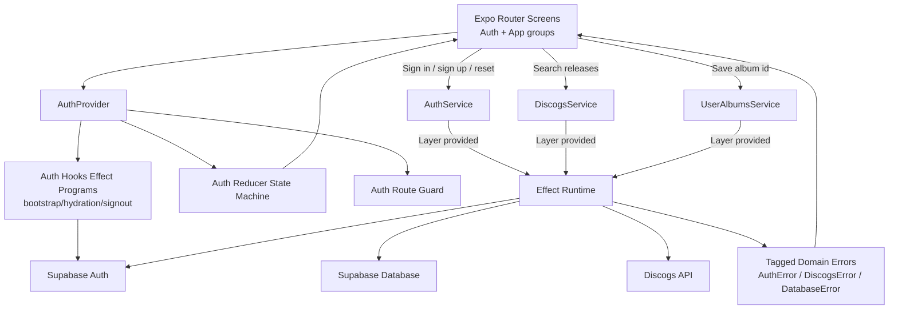
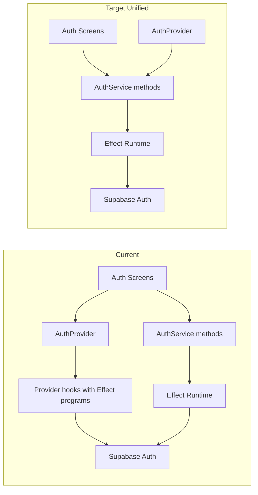

# Side A


Intentional album listening for the streaming era.

Most streaming apps are optimized for tracks, playlists, and passive recommendation loops. Side A is a focused mobile app for people who want to browse and choose full albums like they would from a physical shelf.

## Product Status

This repository currently provides a strong functional scaffold:

- Email/password auth with Supabase (sign in, sign up, sign out, password reset).
- Auth deep link hydration and route protection with Expo Router.
- Discogs release search flow (currently wired to a mock layer by default).
- Save selected Discogs album id to Supabase (`user_albums` table).
- Typed error model and async composition with Effect.

## Stack

- Expo SDK 56 + Expo Router (typed routes enabled)
- React Native 0.85 + React 19
- TypeScript strict mode
- NativeWind + Tailwind CSS
- Supabase JS v2 + AsyncStorage session persistence
- Effect 3.x for typed effects, error channels, and dependency layers
- TanStack Query (configured globally, ready for query-based data flows)

## Architecture



## Effect Usage In This Repo

Effect is used as a practical runtime boundary around side effects, not as a separate framework.

### 1. Shared effect type alias

- `Eff<A, E, R>` in `src/lib/effect/types.ts` standardizes signatures for async programs.

### 2. Services as tagged dependencies

- Services are defined via `Context.GenericTag`:
	- `AuthService`
	- `DiscogsService`
	- `UserAlbumsService`

This creates explicit interfaces for dependencies and enables swappable implementations.

### 3. Layers for implementation wiring

- `Layer.succeed(...)` is used to provide concrete implementations:
	- Live Supabase layer for auth.
	- Mock and API layers for Discogs.
	- Mock and Supabase layers for album persistence.

Top-level functions then provide a layer at the call boundary using `Effect.provide(...)`.

Auth orchestration in `AuthProvider` is also Effect-based (`Effect.tryPromise`, `Effect.match`, `Effect.runFork`, `Effect.runPromise`) inside auth hooks. In other words, auth is not detached from Effect; it currently uses two integration styles:

- Service + Layer style for screen-initiated auth actions (`signInWithEmail`, `signUpWithEmail`, `requestPasswordReset`, `updatePassword`).
- Hook-level Effect programs for session bootstrap, deep-link hydration, and sign-out lifecycle handling.

### 4. Typed error channel

Errors are modeled with tagged classes and narrowed by domain:

- `AuthError`
- `DiscogsError`
- `DatabaseError`

Instead of a single catch-all error type, each flow maps failures into domain-specific tags (`SupabaseAuthError`, `HttpError`, `MissingEnvError`, `UnexpectedError`, etc.) and formats them for UI display.

### 5. Cause-to-domain conversion helpers

- `toAuthFailure`, `toDiscogsFailure`, and `toDatabaseFailure` convert Effect `Cause` values into user-facing domain errors.

This keeps screen components simple while preserving typed failures.

## Internal Handoff: Target Unified Auth Pattern

To reduce architectural drift, the preferred end state is a single auth style where all auth side effects are modeled as service programs and wired through layers.



### Target shape

- Keep `AuthProvider` focused on orchestration and state transitions.
- Move deep-link hydration and session bootstrap operations behind `AuthService` methods.
- Keep screen actions and provider lifecycle actions on the same Effect + Layer boundary.
- Retain the reducer as the single source of auth state transitions.

### Why this helps

- One mental model for all auth operations.
- Easier testing (service-level integration tests plus reducer tests).
- Cleaner observability (uniform error mapping and logging path).
- Easier runtime swapping (mock, live, future test container layers).

## Internal Handoff: Auth Unification Migration Plan

### Phase 0: Baseline and guardrails

- Add snapshot tests for reducer transitions.
- Add focused tests for deep-link param parsing (`code`, token pair, recovery token hash).
- Add smoke checklist for sign-in, sign-up, reset, bootstrap, and sign-out.

Exit criteria:

- Current behavior is captured in tests and manual smoke notes.

### Phase 1: Expand AuthService contract

- Add service methods for:
	- `bootstrapSession`
	- `hydrateFromUrl`
	- `listenAuthEvents` (or a callback registration API)
	- `signOut`
- Keep existing screen-facing methods unchanged.

Exit criteria:

- New methods are implemented in the live layer and return typed `Eff` results.

### Phase 2: Migrate provider hooks to service calls

- Refactor `useAuthSessionBootstrap` to call service programs instead of direct Supabase access.
- Refactor `useAuthDeepLinkHydration` to call `hydrateFromUrl` service method.
- Refactor sign-out hook to use unified service sign-out path.

Exit criteria:

- Provider hooks no longer call Supabase client directly for auth operations.

### Phase 3: Standardize runtime entry points

- Use one execution pattern for provider-triggered auth programs:
	- Fork long-lived listeners intentionally.
	- Run one-shot actions via promise-based runtime helpers.
- Keep cancellation and cleanup explicit.

Exit criteria:

- Auth execution style is consistent across lifecycle and user-initiated operations.

### Phase 4: Observability and failure policy

- Centralize auth error tagging and user message mapping.
- Add structured logging around auth transitions (event, status, route segment).
- Document retry rules for retryable vs non-retryable auth errors.

Exit criteria:

- Auth failures are diagnosable with consistent logs and tags.

### Phase 5: Cleanup

- Remove obsolete direct-Supabase helpers from auth hooks.
- Update architecture diagram and this handoff section to match final implementation.

Exit criteria:

- No duplicated auth pathways remain.

## Auth And Deep Link Notes

- App scheme is `albumshuffle` (see `app.json`).
- Supabase client uses `detectSessionInUrl: false`.
- `useAuthDeepLinkHydration` manually handles both query and hash formats:
	- `code` -> `exchangeCodeForSession`
	- `access_token` + `refresh_token` -> `setSession`
	- `token_hash` + `type=recovery` -> `verifyOtp`

For password recovery to work correctly on device, Supabase redirect URLs should include your app scheme path for reset, for example:

```txt
albumshuffle://reset-password
```

## Getting Started

### Prerequisites

- Node.js `22.x`
- npm

### 1) Install dependencies

```bash
npm install
```

### 2) Configure environment

Create `.env` in the project root:

```bash
EXPO_PUBLIC_SUPABASE_URL=your_supabase_url
EXPO_PUBLIC_SUPABASE_ANON_KEY=your_supabase_anon_key
EXPO_PUBLIC_DISCOGS_TOKEN=your_discogs_token
```

Notes:

- Supabase URL + anon key are required at startup.
- Discogs token is required only when using the real Discogs API layer.

### 3) Start the app

```bash
npm start
```

## Scripts

- `npm start`: Start Expo dev server.
- `npm run android`: Launch Android target.
- `npm run ios`: Launch iOS target.
- `npm run web`: Launch web target.
- `npm run clean:metro`: Remove Metro and `.expo` caches.
- `npm run web:clean`: Clean cache then launch web.
- `npm run lint`: Run Expo ESLint config.
- `npm run typecheck`: Run TypeScript no-emit check.

`patch-package` runs automatically on `postinstall`.

## Repository Structure

```txt
src/
	app/
		_layout.tsx
		index.tsx
		(auth)/
		(app)/
	features/
		auth/
		albums/
		discogs/
	components/
	utils/
	types/
	lib/
		effect/
		query/
		supabase/
		errors/
```

## Implementation Detail: Discogs Search Layer

`searchDiscogsReleases` currently provides the mock layer by default. This is ideal for deterministic UI development.

The current implementation lives in `src/features/discogs/services/discogsService.ts` and is intentionally mock-first while the API decoding pipeline is still being designed.

## Quality Guardrails

- Strictly typed async boundaries (Effect + TypeScript).
- Domain-separated errors with consistent UI formatting.
- Centralized auth orchestration in `AuthProvider` hooks.
- Route-guarded app/auth groups in Expo Router.

## Roadmap Ideas

- Persist and display saved album catalog with pagination.
- Replace local screen state with query/mutation flows where it adds value.
- Add tests for auth reducer, deep-link parsing, and service layer error mapping.
- Add release decoding/validation for Discogs API responses.
